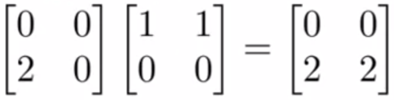
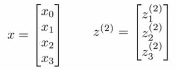

# [Coursera Machine Learning by Andrew Ng](https://www.coursera.org/learn/machine-learning)
- [Week1](#week1)
  - [Introduction](#introduction)
    - [1. What is Machine Learning?](#1-what-is-machine-learning) 
    - [2. Supervised Learning](#2-supervised-learning)
    - [3. Unsupervised Learning](#3-unsupervised-learning)
  - [Model and Cost Function](#model-and-cost-function)
    - [1. Model Representation](#1-model-representation)
    - [2. Cost Function](#2-cost-function)
    - [3. Cost Function Intuition 1](#3-cost-function-intuition-1)
    - [4. Cost Function Intuition 2](#4-cost-function-intuition-2)
  - [Parameter Learning](#parameter-learning)
    - [1. Gradient Descent](#1-gradient-descent)
    - [2. Gradient Descent Intuition 1](#2-gradient-descent-intuition-1)
    - [3. Gradient Descent Intuition 2](#3-gradient-descent-intuition-2)
  - [Linear Algebra Review](#linear-algebra-review)
    - [1. Matrices and Vectors](#1-matrices-and-vectors)
    - [2. Addition and Scalar Multiplication](#2-addition-and-scalar-multiplication)
    - [3. Matrix Vector Multiplication](#3-matrix-vector-multiplication)
    - [4. Matrix Matrix Multiplication](#4-matrix-matrix-multiplication)
    - [5. Matrix Multiplication Properties](#5-matrix-multiplication-properties)
    - [6. Inverse and Transpose](#6-inverse-and-transpose)
- [Week2](#week2)
  - [Multivariate Linear Regression](#Multivariate-linear-regression)
    - [1. Multiple Features](#1-multiple-features)
    - [2. Gradient Descent for Multiple Variables](#2-gradient-descent-for-multiple-variables)
    - [3. Gradient Descent in Practice 1 - Feature Scaling](#3-gradient-descent-in-practice-1---feature-scaling)
    - [4. Gradient Descent in Practice 2 - Learning Rate](#4-gradient-descent-in-practice-2---learning-rate)
    - [5. Features and Polynomial Regression](#5-features-and-polynomial-regression)
- [Week3](#week3)
  - [Classification and Representation](#classification-and-Representation)
    - [1. Classification](#1-classification)
    - [2. Hypothesis Representation](#2-hypothesis-representation)
    - [3. Decision Boundary](#3-decision-boundary)
  - [Logistic Regression Model](#logistic-regression-model)
    - [1. Cost Function](#1-cost-function)
    - [2. Simplified Cost Function and Gradient Descent](#2-simplified-cost-function-and-gradient-descent)
    - [3. Advanced Optimization](#3-advanced-optimization)
  - [Multiclass Classification](#multiclass-classification)
    - [1. Multiclass Classification: One-vs-all](#1-multiclass-classification-one-vs-all)
  - [Solving the Problem of Overfitting](#solving-the-problem-of-overfitting)
    - [1. The Problem of Overfitting](#1-the-problem-of-overfitting)
    - [2. Cost Function](#2-cost-function-1)
    - [3. Regularized Linear Regression](#3-regularized-linear-regression)
    - [4. Regularized Logistic Regression](#4-regularized-logistic-regression)
- [Week4](#week4)
  - [Motivations](#motivations)
    - [1. Non-linear Hypotheses](#1-non-linear-hypotheses)
    - [2. Neurons and the Brain](#2-neurons-and-the-brain)
  - [Neural Networks](#neural-networks)
    - [1. Model Representation I](#1-model-representation-i)
    - [2. Model Representation II](#2-model-representation-ii)
  - [Applications](#applications)
    - [1. Examples and Intuitions I](#1-examples-and-intuitions-i)
    - [2. Examples and Intuitions II](#2-examples-and-intuitions-ii)
    - [3. Multiclass Classification](#3-multiclass-classification)

# Week1
## Introduction
### 1. What is Machine Learning?
컴퓨터가 명시적으로 프로그램되지 않고도 학습할 수 있도록 하는 연구 분야 by Arthur Samuel

만약 어떤 작업 T에서 경험 E를 통해 성능 측정 방법인 P로 측정했을 때 성능이 향상된다면 이런 컴퓨터 프로그램은 학습을 한다고 말한다. by Tom Mitchell
***
### 2. Supervised Learning
**지도 학습**   
이미 결과가 알려진 데이터를 주고 학습시키는 것

**Regresstion(회귀)**   
주어진 데이터를 바탕으로 값을 예측하는 것   
ex) 평수로 주택 가격 예측   

**Classification(분류)**   
어떤 데이터를 여러 값중 하나로 분류하는 것   
ex) 종양 크기로 악성 종양인지 판단   

***
### 3. Unsupervised Learning
**비지도 학습**   
정답을 알려주지 않고 데이터를 군집화 하는것   
데이터가 무엇인지는 정의할 수 없지만 비슷한 특징을 찾아 분류   
ex) 뉴스 기사 분류
***
## Model and Cost Function
### 1. Model Representation

 : 데이터의 총 개수   
 : 번째  데이터  ex)  :    
 : 번째  데이터  ex)  : 

Supervised Learning(지도 학습)의 목표는 를 값에 가깝게 만드는 것이 목표   
여기서 를 hypothesis(가설)이라고 함   

***
### 2. Cost Function
설정한 가설(  )의 정확도를 확인하기 위해 Cost Function(비용 함수)를 사용   
비용 함수의 값이 작을수록(0에 가까울수록) 정확   

비용 함수는 아래와 같이 **Squared error function** or **Mean squared error**(평균 제곱 오차) 방식을 주로 씀

***
### 3. Cost Function Intuition 1
에서 이라고 가정

데이터 셋:   
   
   
   

이면 위 그래프와 같이 데이터와 완벽이 일치한다. 이때 비용 함수를 구해 보면   
   
과 같이 이 나온다.

이면 위 그래프와 같은 모양이 나온다. 여기서 비용 함수를 구해 보면   
   
과 같이 약 이 나온다. 아까 데이터와 그래프가 완벽히 일치했을 때의 비용 함수 값보다 더 크다.

값에 따른 비용 함수의 값을 좌표평면 위에 나타내면 아래와 같은 개형의 그래프가 그려진다.   

***
### 4. Cost Function Intuition 2

그래프와 데이터의 분포가 비슷할수록 등고선 그래프의 나타난 비용 함수의 값이 최하점에 가까워지는 것을 볼 수 있다.
***
## Parameter Learning
### 1. Gradient Descent
비용 함수의 값을 최소화하기 위해 사용하는 방법중에는 Gradient Descent(경사 하강법)이 있다.  
경사 하강법은 그래프의 최소값을 찾기 위해 말 그대로 경사를 따라 내려가는 방식이다.   

위 그림과 같이 시작점에 따라 도착하는 지점이 다를 수 있다.

경사 하강법의 식은 위와 같으며 과 에 대해 따로 계산(편미분)하며 최소값에 수렴할 때 까지 반복한다.   
여기서 를 Learning Rate(학습률)이라 하고 학습률의 크기에 따라 한번에 내려가는 거리가 결정된다.

경사 하강법을 계산할 때는 위와 같이 과 에 대한 값을 미리 계산한 다음에 대입하여야 한다. 오른쪽과 같이 계산 - 대입 - 계산 - 대입 순으로 계산하면 이상한 값이 나올 수도 있다.
***
### 2. Gradient Descent Intuition 1

시작점이 최소값의 오른쪽일 때는 기울기가 양수이기 때문에 왼쪽으로 이동하게 되고 반대로 왼쪽일 때는 기울기가 음수이기 때문에 오른쪽으로 이동하게 된다.

만약 학습률이 너무 작다면 조금씩 이동하기 때문에 최소값을 찾는데 너무 오래걸리게 된다.   
반대로 학습률이 너무 크다면 최소값으로 가지 못하고 오히려 멀어지게 된다.

최소값에 가까워질수록 기울기가 0에 가까워지기 때문에 한번에 이동하는 거리가 짧아진다. 따라서 하강하는 도중 학습률을 수정(조정)할 필요가 없다.
***
### 3. Gradient Descent Intuition 2
앞에서 봤던 비용 함수   
   
와 경사하강법   
   
을 결합하면

(에 대한 계산(미분))

이므로 아래와 같은 식이 나온다.

에 대해 계산해도 위와 같은 식이 나온다.

***
## Linear Algebra Review
### 1. Matrices and Vectors
Matrix(행렬): 수를 직사각형 모양으로 배열한 것

: 번째 열의 번째 행에 위치한 원소   
ex) :    
:    

Vector(백터): 모양의 행렬

: 번째 열에 위치한 원소   
ex) : 
***
### 2. Addition and Scalar Multiplication
**행렬의 덧셈(행렬 + 행렬)**

ex)

**행렬의 곱셈(상수 X 행렬)**

ex)

***
### 3. Matrix Vector Multiplication
**행렬 X 백터**

ex)

**집 가격 예측 예제**

위와 같은 데이터가 있고

위와 같이 과 을 과 로 설정했을 때 아래와 같이 나타낼 수 있다.

***
### 4. Matrix Matrix Multiplication
**행렬 X 행렬**

ex)

 모양의 행렬과 곱하려면  모양의 행렬이어야 한다. 이때 결과는  모양의 행렬이 나온다.

**집 가격 예측 예제**

다음과 같은 데이터와 가설들이 있을 때, 아래와 같이 계산할 수 있다.

***
### 5. Matrix Multiplication Properties
**교환법칙(commutative property)**

두 행렬 와 가 있을 때, 이다.(교환법칙이 성립하지 않는다.)

ex)

**결합법칙(associated law)**

행렬 , 와 가 있을 때, 이다.(결합법칙이 성립한다.)

ex)

**항등행렬(identity matrix)**

위와 같이 행과 열의 수가 같고 왼쪽 위부터 오른쪽 아래를 잇는 대각선(주대각선)에 있는 원소가 모두 1이고 나머지 원소는 0인 행렬을 항등행렬이라고 한다.
***
### 6. Inverse and Transpose
**역행렬(Inverse Matrix)**

행렬 와 곱했을 때 항등행렬이 나오는 행렬을 의 역행렬이라 하고 와 같이 표현한다.

ex)

**전치행렬(Transposed Matrix)**

행렬 의 행과 열을 맞바꾼 행렬을 의 전치행렬이라 하고 와 같이 표현한다.

ex)

행렬 를 행렬 의 전치행렬이라고 한다.   
주대각선을 기준으로 서로 대칭을 이룬다.
***

# Week2
## Multivariate Linear Regression
### 1. Multiple Features

: 특징(feature)의 수  ex)  Price는    
: 번째 데이터(학습 예제)  ex) :    
: 번째 데이터(학습 예제)의 번째 특징의 값  ex) : 

특징이 많을 때는 가설을 아래와 같이 표현한다.

여기서 계산과 표기를 쉽게하기 위해 을 설정한다.

***
### 2. Gradient Descent for Multiple Variables

이전에 경사하강법(Gradient Descent)을 아래와 같이 표현했었는데,

변수(특징)가 여러개일 때는 아래와 같이 표현한다.

***
### 3. Gradient Descent in Practice 1 - Feature Scaling
경사하강법의 계산 속도를 증가시키기 위해 Feature Scaling을 진행한다.   
Feature Scaling은 값을 이나  사이로 만든다.

계산식은 아래와 같다.

: 값들의 평균   
:  또는 표준편차
***
### 4. Gradient Descent in Practice 2 - Learning Rate
만약 (Learning Rate)이 너무 크다면 반복할 때마다 비용함수의 값이 증가한다.   
만약 (Learning Rate)이 너무 작다면 반복할 때마다 비용함수의 값이 매우 조금씩 감소한다.

만약 가 충분히 작다면 반복할 때마다 비용함수의 값이 계속 감소한다.
***
### 5. Features and Polynomial Regression

위와 같은 데이터가 있을 때, 직선(일차함수) 모양의 가설로는 정확한 예측을 하기 어렵다.   
이때 아래와 같은 가설을 사용할 수 있다.

여기서 이나 은 Size를 제곱, 세제곱한 값이다.
***

# Week3
## Classification and Representation
### 1. Classification
분류는 어떤 데이터를 여러 값중 하나로 분류하는 것이다.

ex)
스팸 메일 분류, 온라인 거래 사기 유무, 종양 악성 유무

**Classification with Linear Regression**

위와 같은 데이터에 선형 회귀(Linear Regression)을 적용하면 그림과 같은 그래프가 나온다.   
인 지점을 기준으로 앞은 양성종양, 뒤는 악성종양으로 분류하면 꽤 괜찮은 것 같이 보인다. 하지만 아래와 같은 그림을 보면 결과가 달라진다.

아까와 같이 인 지점을 기준으로 나누면 문제가 생긴다. 

이와 같이 분류(Classification) 문제는 선형 회귀를 통해 해결하기에는 무리가 있다.(일부 데이터에서는 정상적으로 작동할 수 있어도 대부분은 잘 작동하지 않을 것이다.)
***
### 2. Hypothesis Representation

Logistic Regression에서는 아래와 같은 가설을 사용한다.

여기서 맨 아래에 있는 식은 Sigmoid Function 또는 Logistic Function이라고 하며 개형은 아래와 같다.

가설을 위와 같이 표현할 수도 있는데, 는 쉽게 말해 가 인 확률을 의미한다.

***
# 3. Decision Boundary

만약 이면 이고,   
만약 이면 이다.

**Decision Boundary(Linear)**

위와 같은 데이터와 가설이 있을 때, 이라고 하면 일 때, 이 된다.

예를 들어 이면 이므로 이 된다. 실제로 그림에서 확인해보면  지점은 그래프아래에 위치하는것을 볼 수 있다.

**Decision Boundary(Non-linear)**

이번에는 직선으로 두 데이터를 나누기는 어려워 보인다. 이럴때에는 Polynomial Regression에서 했던것 처럼 위와 같이 가설을 만들어 주면 된다. 

와 같이 설정해 주면  일 때, 이 된다.   
여기서 앞에 나온 식은 반지름이 1이고 중심이 인 원의 방정식이다.

이렇게 데이터를 나누는 경계선을 **Decision Boundary**라고 하며, 이는 가설에 의해 결정된다는 것을 알 수 있다.
***

## Logistic Regression Model
### 1. Cost Function

Logistic Regression의 비용함수는 위와 같다.   
에 따라 식이 달라지는데 그 이유는 아래 그래프를 보면 된다.

을 지나는 그래프가 의 적용되는 비용함수이고 다른 그래프는 그 반대이다.

가설 의 값은 시그모이드 함수를 통해 정해지기 때문에 무조건 과  사이의 값을 가진다. 

만약 결과()가 일때, 가설의 값이 에 가까울수록(정확할수록) 작아지고(에 가까워지며 이외에는 양수이다.) 가설의 값이 에 가까울수록(부정확할수록) 기하급수적으로 커진다. 

***

### 2. Simplified Cost Function and Gradient Descent

   

비용함수를 간단하게 표현하면 위와 같다. 값이 이나 일때에 때라 두 항중 하나의 항이 사라지게 된다.

vectorized한 식은 아래와 같다.

비용함수를 미분한 식은 아래와 같은데,

놀랍게도 선형회귀의 비용함수를 미분한 식과 같다.

***

### 3. Advanced Optimization

경사하강법 외에도 conjugate gradient, BFGS, L-BFGS와 같은 여러 알고리즘들이 존재한다.

이러한 알고리즘들은 경사하강법보다 빠르고 학습률을 정해주지 않아도 되지만 복잡하다는 단점이 있다.
***

## Multiclass Classification
### 1. Multiclass Classification: One-vs-all

결과값이 과  중에서만 나오는 이진 분류와 달리 그 3개 이상의 결과값이 나오는 경우가 있을 수도 있다.

ex)   
이메일 분류 : 업무, 친구, 가족, 취미

위와 같이 결과값이 3개인 경우에는 각 class와 나머지 class를 나누어서 가설을 3개 만들면 된다.   
나중에 예측할 때에는 3개의 가설을 모두 테스트 해본 뒤에 가장 큰 값이 나온 가설에 해당하는 class일 확률이 높다고 판단하면 된다.(시그모이드 함수를 통해 계산하기 때문에 가장 큰 수일 수록 1에 가깝다. 즉 확률이 높다는 뜻이다.)

이러한 방식을 One-vs-all 방식이라고 한다.

수식으로 표현하면 아래와 같다.

***

## Solving the Problem of Overfitting
### 1. The Problem of Overfitting

위 그림에서 왼쪽에 있는 그래프는 데이터와 별로 일치하지 않는 모습을 보여준다. - underfitting(과소적합)   
위 그림에서 중간에 있는 그래프는 데이터와 나름 잘 일치하는 모습을 보여준다.   
위 그림에서 오른쪽에 있는 그래프는 데이터와 너무 잘 일치하는 모습을 보여준다.(하지만 정확한 예측을 할것이라고 보기는 어렵다.) - overfitting(과적합)

이렇게 데이터와 잘 일치하지 않는 현상을 underfitting이라고 하고 데이터와 너무 잘 일치하는 현상을 overfitting이라고 한다. overfitting이 문제인 이유는 training set에만 너무 잘 맞아 실제 예측을 할 때 정확한 결과는 내놓기 어렵기 때문이다.

위 그림에서도 왼쪽부터 차례대로 underfitting, 정상, overfitting을 보여주고 있다.

**Overfitting이 일어나는 이유**

overfitting이 일어나는 이유는 너무 많은 특징(feature)을 사용했어나 너무 고차항의 가설을 설정했기 때문이다.

**Overfitting 해결방법**

1. Feature의 수를 줄인다.
    - 필요한 Feature만 선택한다.
    - Model Selection 알고리즘을 사용한다.
2. Regularization(정규화)
    - 모든 Feature을 유지하되 θ의 값을 작게한다.
    - Feature가 결과 값을 예측하는데 조금씩만 작용하게 한다.

***
### 2. Cost Function

위 그림의 오른쪽 그래프와 같은 overfitting 문제를 해결하기 위해서는 값을 작게 만들어 주면 된다.

위 식과 같이 비용함수의 부분에 큰 수를 곱해주면 된다.

**Regularization(정규화)**

들이 작은 값을 갖도록 설정한다.
  - 가설을 단순하게 한다.
  - overfitting 가능성이 작아진다.

위 식처럼 작게 만들고 싶은 값 앞에 (패널티)를 곱한다.

하지만 여기서 가 너무 크다면 underfitting이 될 수도 있다.
***
### 3. Regularized Linear Regression

**Gradient Descent**

정규화를 적용한 비용함수를 경사하강법과 결합한 후 편미분 하면 위와 같은 식이 나온다.   
의 경우 어짜피 이 이기 때문에 정규화를 할 필요가 없다.

식을 정리하면 위와 같은 식이 나온다.

**Normal Equation**

Normal Eeuation은 위와 같은 방법으로 진행할 수 있다.

***
### 4. Regularized Logistic Regression

로지스틱 회귀에서의 정규화는 위와 같이 비용함수 마지막에 가 포함된 식이 더해진 방식으로 쓸 수 있다.

경사하강법은 위와 같이 쓸 수 있다.   
선형 회귀에서의 정규화와 마찬가지로 이 이기 때문에 는 정규화 하지 않아도 된다.
여기서 가설함수 는 선형 회귀와 달리 시그모이드 함수를 통해 계산된 값이다.

***

# Week4
## Motivations
### 1. Non-linear Hypotheses

위 그림과 같이 복잡하거나 비선형적인 분류 문제는 Feature가 너무 많아 계산도 오래걸리고 overfitting이 일어나기 쉽다.   
만약 Feature가 100개정도 있다고 할 때, 나오는 항의 개수는 5000개나 된다.(100개중에 2개를 고르는 조합 문제이다.)

우리가 자동차를 볼 때는 왼쪽 그림처럼 보지만 컴퓨터가 자동차를 볼때는 오른쪽 그림처럼 행렬의 형태로 본다. 여기서 행렬의 원소들은 각 픽셀의 밝기이다.

그림과 같이 픽셀 2개를 가져와 그래프에 나타내면 자동차와 자동차가 아닌 것이 나뉘어지는 모습을 볼 수 있다.

만약 개의 픽셀이 있다면 총 2500개의 Feature가 있는것인데 우리가 배운 방식으로 계산(분류)하려면 약 300만개의 항이 나온다. 이렇게 많은 feature가 나와버리면 overfitting이 일어날 수도 있고 계산하는데 너무 많은 시간이 필요하다.

***
### 2. Neurons and the Brain
뉴럴 네트워크는 예전에 발명되었지만 계산하는데 필요한 자원이 너무 커서 주목받지 못했다. 하지만 요즘에는 기술이 발전해 뉴럴 네트워크를 사용할 수 있을정도로 계산 속도가 빠른 컴퓨터가 있어 다시 주목받고 있다.

위 그림처럼 청각을 맡고있는 부분에 시신경을 연결하면 뇌가 학습해 보는 법을 배운다.

뉴럴 네트워크는 이러한 뇌의 특징을 모방해 컴퓨터가 스스로 학습하게 하려는 목적에서 연구되었다.
***

## Neural Networks
### 1. Model Representation I

위 그림은 뉴련의 구조인데, 뉴런은 수상 돌기로 신호를 받아 축삭 돌기로 출력한다.   
뉴럴 네트워크는 뉴런의 이런 특징을 모방하여 만든 알고리즘이다.

위 그림은 뉴럴 네트워크의 구조를 간단하게 나타낸 것이다.   
여기서 세로로 나누면 3개의 층이 나오는데 첫번째 층을 입력층, 두번째 층을 은닉층, 마지막 층을 출력층이라고 한다.

각 층에는 bias unit 이라고 해서 와 같이 표현하는데, 항상 값이 1 그림을 그릴 때에는 주로 생략한다.

는 classification에서와 마찬가지로 시그모이드 함수를 사용한다.

: 번째 층의 번째 유닛   
: 번째 층에서 번째 층으로 가는 가중치 행렬이다.

계산은 위와 같이 한다.

: 번째 층의 번째 유닛에서  번째 층의  번째 유닛으로 가는 가중치   
ex)  : 1번째 층의 1번째 유닛에서 2번째 층의 2번째 유닛으로 가는 가중치

***
### 2. Model Representation II

앞에서 배웠던 식에서 안에 있는 식을 와 같이 나타낼 수 있고 번째 층의 번째 유닛으로 간다는 뜻이다.

위와 같이 와 를 행렬 형태로 나타낼 수 있다. 

그럼 위와 같이 행렬의 곱 형태로 나타낼 수 있다.   
여기서  대신 이라고 나타낼 수도 있다.

이렇게 앞으로 나아가며 계산하는 것을 Forward propagation이라고 한다.

위 그림과 같은 모양의 뉴럴 네트워크에서는 2번째 층과 3번째 층이 은닉층이다.
***

## Applications
### 1. Examples and Intuitions I

**And 게이트**

가중치가 위부터 차례대로 -30, 20, 20이라고 하면 아래 표처럼 And 게이트가 만들어진다.

**Or 게이트**

위와 같은 뉴럴 네트워크가 있을 때, 값에 따른 결과값은 아래와 같다.

이렇게 뉴럴 네트워크는 기존의 방식으로 만들기 어려웠던 다양한 논리 게이트나 시스템들을 만들 수 있게 해준다.

***
### 2. Examples and Intuitions II

위와 같은 뉴럴 네트워크로 negation(부정)을 나타낼 수 있다.   
이걸 응용하면 아래와 같이 nand 게이트를 만들 수 있다.

그리고 이 3가지 게이트를 조합하면 아래와 같이 xnor 게이트를 만들 수 있다.

***
### 3. Multiclass Classification

주어진 이미지를 위와 같이 4개의 class로 중 무엇인지 판단할 때, 뉴럴 네트워크를 아래와 같이 나타낼 수 있다.

4개의 class로 분류해야 하기 때문에 출력층이 4개이다.

결과값은 위와 같이  형태의 행렬이며, 해당하는 class만 1로 나오고 나머지는 0으로 나온다.

***
